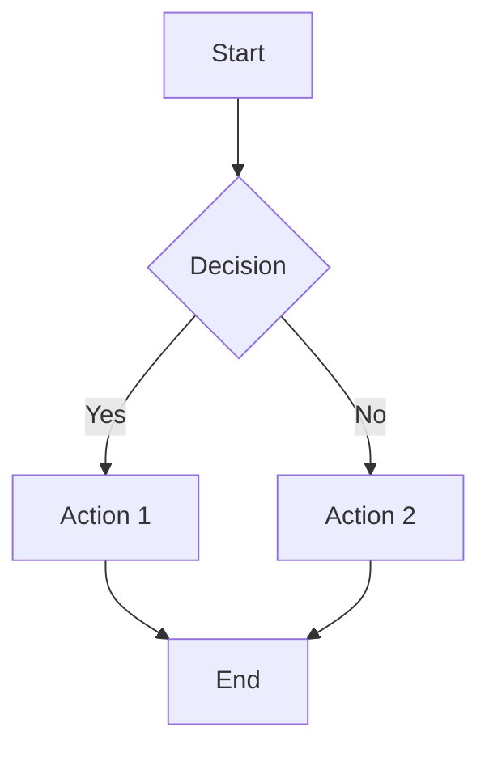
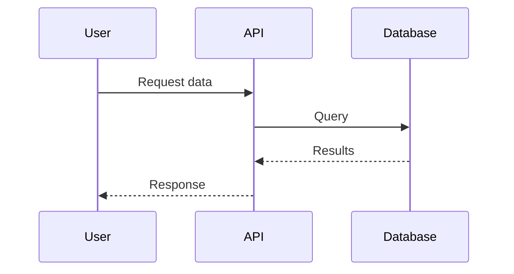
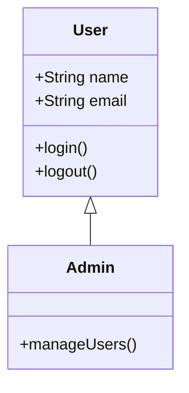
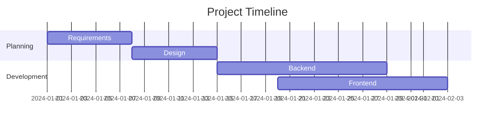
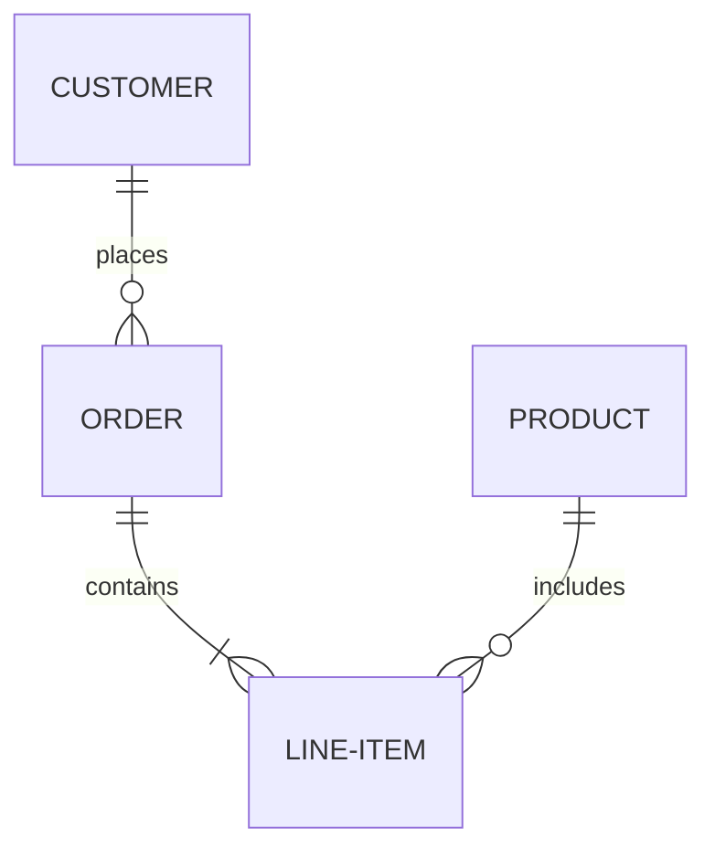

# Markdown & Mermaid Diagrams with GitHub Copilot

## Session Overview
- **Duration:** 60 minutes
- **Audience:** Development team (all levels)
- **Focus:** Markdown basics, Mermaid diagrams, and leveraging Copilot for documentation
- **Format:** Interactive with hands-on assignments applicable to any project

---

## Agenda

| Time | Topic | Duration |
|------|-------|----------|
| 0-10 min | Markdown Fundamentals | 10 min |
| 10-20 min | Mermaid Diagrams Introduction | 10 min |
| 20-30 min | GitHub Copilot for Documentation | 10 min |
| 30-40 min | Live Demo & Best Practices | 10 min |
| 40-55 min | Interactive Team Assignments | 15 min |
| 55-60 min | Q&A & Wrap-up | 5 min |

---

## Part 1: Markdown Fundamentals (0-10 min)

### What is Markdown?

Markdown is a lightweight markup language that you can use to add formatting elements to plaintext text documents. Created by John Gruber in 2004, Markdown is now one of the world’s most popular markup languages.

- Lightweight markup language for creating formatted text
- Plain text format that's easy to read and write
- Widely used in: README files, documentation, GitHub, wikis, blogs

**Markdown syntax is designed to be readable and unobtrusive, so the text in Markdown files can be read even if it isn’t rendered.**

## Basic Syntax

These are the elements outlined. All Markdown applications support these elements.

### Heading

### Essential Syntax

#### Headers
```markdown
# H1 - Main Title
## H2 - Section
### H3 - Subsection
```

# H1 Example
## H2
### H3

#### Text Formatting
```markdown
**Bold text**
*Italic text*
~~Strikethrough~~
`Inline code`
```

**bold text to**

*italicized text*

~~srikethrough~~

`inline code`


#### Blockquotes
```markdown
> This is a quote
> It can span multiple lines
```
> This is a quote

> It can span multiple lines.

#### Lists
```markdown
- Unordered item 1
- Unordered item 2
  - Nested item
      - Nested item

1. Ordered item 1
2. Ordered item 2
```
- Unordered item 1
- Unordered item 2
  - Nested item
      - Nested item

1. Ordered item 1
2. Ordered item 2

#### Unordered List

- First item
- Second item
- Third item

#### Ordered List

1. First item
2. Second item
3. Third item

#### Code

`code`

```javascript
function greet() {
  console.log("Hello, World!");
}
```


`#### Horizontal Rule

---

#### Link

[Markdown Guide](https://www.markdownguide.org)

#### Image


#### JSON Examples
```json
{
  "name": "John Doe",
  "age": 30,
  "city": "New York",
  "skills": ["JavaScript", "Python", "Azure"],
  "active": true,
  "projects": [
    {
      "name": "Web App",
      "status": "completed",
      "technologies": ["React", "Node.js"]
    },
    {
      "name": "API Service", 
      "status": "in-progress",
      "technologies": ["Python", "FastAPI", "Azure Functions"]
    }
  ]
}
```

#### HTTP Examples
```http
GET /api/users HTTP/1.1
Host: example
Authorization: Bearer <token>
```

## Extended Syntax

These elements extend the basic syntax by adding additional features. Not all Markdown applications support these elements.

#### Tables
```markdown
| Column 1 | Column 2 | Column 3 |
|----------|----------|----------|
| Data 1   | Data 2   | Data 3   |
| Data A   | Data B   | Data C   |
```


| Syntax | Description |
| ----------- | ----------- |
| Header | Title |
| Paragraph | Text |

### Fenced Code Block

```
{
  "firstName": "John",
  "lastName": "Smith",
  "age": 25
}
```

### Footnote

Here's a sentence with a footnote. [^1]

[^1]: This is the footnote.

### Heading ID

### My Great Heading {#custom-id}

### Definition List

term
: definition
: definition 2

term2
: definition of term2

### Strikethrough

~~The world is flat.~~

### Task List

- [x] Write the press release
- [ ] Update the website
- [ ] Contact the media

### Emoji

That is so funny! :joy: :tent:

(See also [Copying and Pasting Emoji](https://www.markdownguide.org/extended-syntax/#copying-and-pasting-emoji))

### Highlight

I need to highlight these ==very important words==.

### Subscript

H~2~O

### Superscript

X^2^
---


## Part 2: Mermaid Diagrams (10-20 min)

### What is Mermaid?
- JavaScript-based diagramming tool
- Create diagrams using text and code
- Supported natively in GitHub, GitLab, and many documentation tools
- No need for external diagram tools!

### Common Diagram Types

#### 1. Flowcharts


**Use cases:** Process flows, decision trees, workflows

#### 2. Sequence Diagrams


**Use cases:** API interactions, system communication, user flows

#### 3. Class Diagrams


**Use cases:** Object-oriented design, database schemas

#### 4. Gantt Charts


**Use cases:** Project planning, sprints, milestones

#### 5. Entity Relationship Diagrams


**Use cases:** Database design, data modeling

---


## Part 3: GitHub Copilot for Documentation (20-30 min)

### How Copilot Helps with Documentation

#### 1. **Auto-completing Markdown Structure**
When you start typing, Copilot suggests:
- Headers and section layouts
- Common documentation patterns
- Table structures

**Example prompt in comments:**
```markdown
<!-- Create a README with sections for installation, usage, and contributing -->
```

#### 2. **Generating Mermaid Diagrams**
Copilot can create diagrams from natural language descriptions.

**Example prompts:**
```markdown
<!-- Create a flowchart for user authentication process -->
<!-- Generate a sequence diagram showing API request flow -->
<!-- Draw a class diagram for an e-commerce system -->
```

#### 3. **Writing Technical Documentation**
Copilot excels at:
- API documentation
- Function/method descriptions
- Configuration guides
- Troubleshooting sections

**Example:**
```markdown
## API Endpoints

### POST /api/users
<!-- Copilot will suggest: Description, parameters, response format -->
```

#### 4. **Creating Tables and Lists**
Start typing and let Copilot complete:
```json
{
  "name": "Feature Table",
  "columns": ["Feature", "Status", "Priority"],
  "rows": [
    ["Login", "Complete", "High"],
    ["Signup", "In Progress", "Medium"],
    ["Profile Update", "Pending", "Low"]
  ]
}
```


```markdown
| Feature | Status | Priority |
|---------|--------|----------|
<!-- Copilot fills in rows -->
```

### Best Practices with Copilot

#### ✅ DO:
1. **Use descriptive comments** - Tell Copilot what you want
2. **Start with structure** - Begin with headers, Copilot fills details
3. **Iterate** - Accept suggestions, then refine
4. **Provide context** - Reference existing files/patterns
5. **Review generated diagrams** - Ensure accuracy and clarity

#### ❌ DON'T:
1. **Blindly accept** - Always review and validate
2. **Over-rely** - Use Copilot to augment, not replace thinking
3. **Ignore style guides** - Maintain consistency with team standards
4. **Skip validation** - Test Mermaid syntax before committing

### Copilot Shortcuts & Tips

**Trigger suggestions:**
- `Alt + \` (Windows/Linux) or `Option + \` (Mac) - Trigger inline suggestion
- Tab - Accept suggestion
- `Alt + ]` / `Option + ]` - Next suggestion
- `Alt + [` / `Option + [` - Previous suggestion

**Effective prompting:**
```markdown
<!-- TODO: Add architecture diagram showing microservices -->
<!-- FIXME: Document the authentication flow -->
<!-- NOTE: Create a table of environment variables -->
```

---

## Part 4: Live Demo & Best Practices (30-40 min)

### Demo Scenario: Creating Project Documentation

**Step 1:** Create README structure with Copilot
```markdown
# Project Name
<!-- Let Copilot suggest standard README sections -->
```

**Step 2:** Generate a system architecture diagram
```markdown
<!-- Create a flowchart showing the system architecture with frontend, backend, and database -->
```

**Step 3:** Document API endpoints with Copilot assistance
```markdown
## API Documentation
<!-- Copilot suggests endpoint documentation -->
```

**Step 4:** Create a contribution guide
```markdown
## Contributing
<!-- Generate steps for contributing to this project -->
```

### Documentation Best Practices

1. **Keep it Simple** - Clear, concise language
2. **Use Visual Aids** - Diagrams explain better than paragraphs
3. **Maintain Consistency** - Follow team conventions
4. **Version Control** - Treat docs like code
5. **Keep Updated** - Documentation rots quickly
6. **Use Templates** - Standardize documentation across projects

### Mermaid Tips

- **Test locally** - Use Mermaid Live Editor (mermaid.live)
- **Keep diagrams focused** - One concept per diagram
- **Use meaningful labels** - Clear node and edge descriptions
- **Version with code** - Diagrams in repo = always up-to-date
- **Consider accessibility** - Add descriptions for screen readers

---

## Resources

### Quick Reference
- [Markdown Guide](https://www.markdownguide.org/)
- [Mermaid Documentation](https://mermaid.js.org/)
- [Mermaid Live Editor](https://mermaid.live/)
- [GitHub Markdown Spec](https://github.github.com/gfm/)

### Copilot Resources
- [GitHub Copilot Documentation](https://docs.github.com/copilot)
- [Copilot Best Practices](https://github.blog/developer-skills/github/how-to-write-better-prompts-for-github-copilot/)

---

## Key Takeaways

🎯 **Markdown** is essential for modern documentation

🎯 **Mermaid** enables code-based diagrams that version with your code

🎯 **Copilot** accelerates documentation by suggesting structure and content

🎯 **Best practice:** Treat documentation as code - review, refine, version control

🎯 **Remember:** Copilot assists, but you validate and maintain quality

---

## Part 5: Interactive Team Assignments (40-55 min)

### Assignment Format
- **Duration:** 15 minutes total
- **Format:** Individual or pairs
- **Goal:** Hands-on practice with real scenarios
- **Share:** Volunteers present solutions (2 min at end)

---

### 🎯 Assignment 1: Document a REST API (4 min)
**Difficulty:** ⭐⭐ Intermediate

**Scenario:** You need to create API documentation for your team's user management service.

**Your Task:**
1. Create a markdown file called `User_API_Documentation.md`
2. Use GitHub Copilot to help you document:
   - API overview and base URL
   - Authentication requirements
   - At least 3 endpoints (GET, POST, DELETE)
   - Request/response examples in JSON
3. Include a table showing HTTP status codes and their meanings
4. Add code examples using proper syntax highlighting

**Copilot Prompt Hint:**
```markdown
<!-- Create REST API documentation for a user management service with endpoints for CRUD operations -->
```

**Bonus Challenge:** Add a section for rate limiting and error handling

---

### 🎯 Assignment 2: Visualize a Microservices Flow (4 min)
**Difficulty:** ⭐⭐⭐ Advanced

**Scenario:** Management wants to understand how your e-commerce checkout process works.

**Your Task:**
Create a Mermaid sequence diagram showing:
1. User submits order via frontend
2. API Gateway routes request
3. Order Service validates cart
4. Payment Service processes payment
5. Inventory Service reserves items
6. Notification Service sends confirmation email
7. Response returned to user

**Copilot Prompt Hint:**
```markdown
<!-- Create a sequence diagram showing e-commerce checkout flow with microservices architecture -->
```

**Expected Elements:**
- At least 5 participants: User, APIGateway, OrderService, PaymentService, NotificationService
- Show both successful flow and error handling (payment failure)
- Include async operations where appropriate

---

### 🎯 Assignment 3: Development Workflow Flowchart (5 min)
**Difficulty:** ⭐⭐⭐ Advanced

**Scenario:** Document your team's code review and deployment process.

**Your Task:**
Create a flowchart showing the development workflow:
1. Start: Developer creates feature branch
2. Write code and unit tests
3. Decision: All tests pass?
   - No → Fix issues, return to step 2
   - Yes → Create pull request
4. Decision: Code review approved?
   - No → Address feedback, return to step 2
   - Yes → Merge to main branch
5. CI/CD pipeline runs
6. Decision: Deployment successful?
   - No → Rollback and investigate
   - Yes → Monitor in production
7. End

**Copilot Prompt Hint:**
```markdown
<!-- Create a flowchart for software development workflow from feature branch to production deployment -->
```

**Bonus Challenge:** Add a separate Gantt chart showing sprint timeline (using Mermaid)

---

### 🎯 Assignment 4: Create a Troubleshooting Guide (3 min)
**Difficulty:** ⭐ Beginner-Friendly

**Scenario:** Document a common issue for the team wiki.

**Your Task:**
Create a markdown document for this common problem:

**Title:** "Troubleshooting: Docker Container Won't Start"

**Required Sections:**
1. **Problem Description** (use blockquote for the error message)
2. **Root Causes** (use an unordered list)
3. **Solution Steps** (use an ordered list)
4. **Verification** (use a task list with checkboxes)
5. **Related Links** (use markdown links)

**Copilot Prompt Hint:**
```markdown
<!-- Create troubleshooting guide for Docker container startup failures with problem, causes, solutions, and verification steps -->
```

**Include:**
- Code block showing diagnostic commands (`docker logs`, `docker ps`)
- A warning callout using blockquote
- Table of common error messages and their meanings

---

### 🎯 Bonus Challenge: Complete Documentation Set (If time permits)
**Difficulty:** ⭐⭐⭐⭐ Expert

**Scenario:** Create comprehensive documentation for a full-stack web application.

**Combine all skills:**
1. **README.md** with project overview, setup instructions, and tech stack
2. **Architecture diagram** (Mermaid C4 or flowchart) showing:
   - Frontend layer (React/Vue/Angular)
   - API layer (REST/GraphQL)
   - Business logic layer
   - Database layer
   - External services (Auth, Payment, etc.)
3. **ER diagram** showing key database entities and relationships
4. **Class diagram** for main domain models
5. **Deployment guide** with environment variables and CI/CD pipeline

**Leverage Copilot throughout:**
- Use comments to guide generation
- Accept and refine suggestions iteratively
- Combine multiple diagram types

---

### Assignment Submissions

**How to Share:**
1. Save your work in a new `Training_Exercises/` folder
2. Commit to a feature branch: `training/markdown-mermaid-{yourname}`
3. Share screen for 30 seconds to show your solution

**What We're Looking For:**
- ✅ Proper Markdown syntax
- ✅ Valid Mermaid diagrams (test in Mermaid Live Editor)
- ✅ Effective use of Copilot prompts
- ✅ Clear, readable documentation
- ✅ Practical, real-world scenarios

**Evaluation Criteria:**
- **Clarity:** Is it easy to understand?
- **Completeness:** Does it cover the requirements?
- **Correctness:** Is the Mermaid syntax valid?
- **Creativity:** Did you go beyond the basics?

---

### Tips for Success

💡 **Start simple, iterate:** Get basic structure first, then enhance

💡 **Test diagrams:** Use [mermaid.live](https://mermaid.live) to validate syntax

💡 **Prompt effectively:** Tell Copilot what you want in comments

💡 **Review suggestions:** Don't blindly accept—ensure accuracy

💡 **Ask for help:** Collaborate with your partner or neighbors

---

## Q&A & Wrap-up (55-60 min)

Common questions to prepare for:
- How to integrate Mermaid in our current tools?
- What if Copilot suggests incorrect diagrams?
- How to maintain diagram consistency across team?
- Best practices for documenting legacy systems?
- Where should we store team documentation?

### Quick Wins to Implement This Week
1. Convert one existing Word doc to Markdown
2. Add a Mermaid diagram to your current PR
3. Use Copilot to update a README file
4. Share one documentation improvement with the team

---

## Action Items

After this session, team members should:
- [ ] Complete at least 2 of the 4 training assignments
- [ ] Update one README file using Markdown best practices
- [ ] Create at least one Mermaid diagram for their current work
- [ ] Experiment with Copilot for documentation tasks
- [ ] Share completed assignments in team channel
- [ ] Review and provide feedback on peer documentation
- [ ] Identify one undocumented component or process to document this sprint

---

**Thank you! Happy Documenting! 📝**
